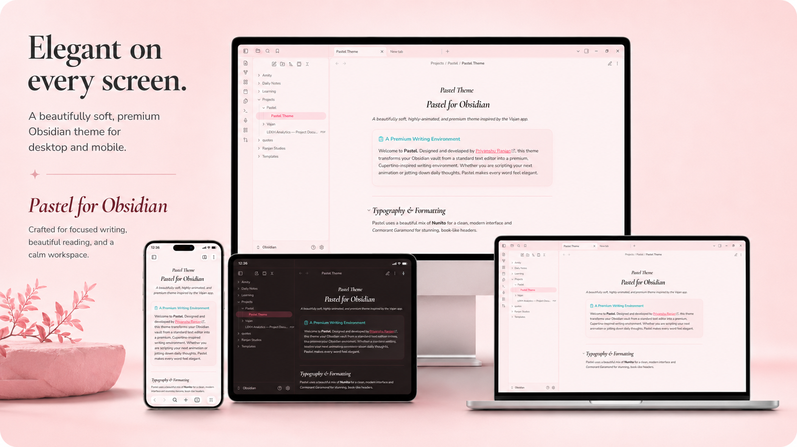
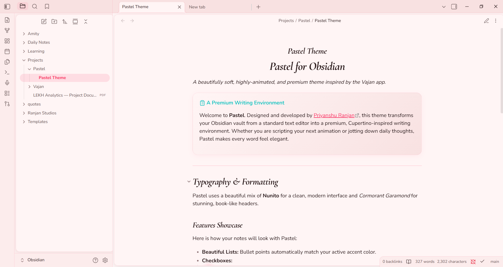
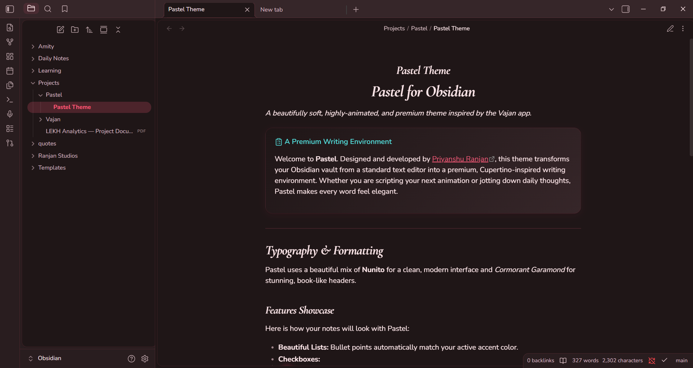
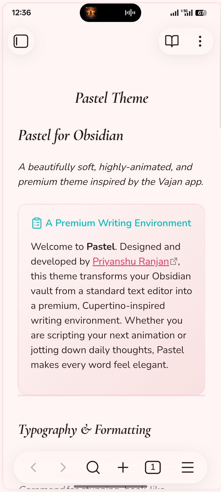
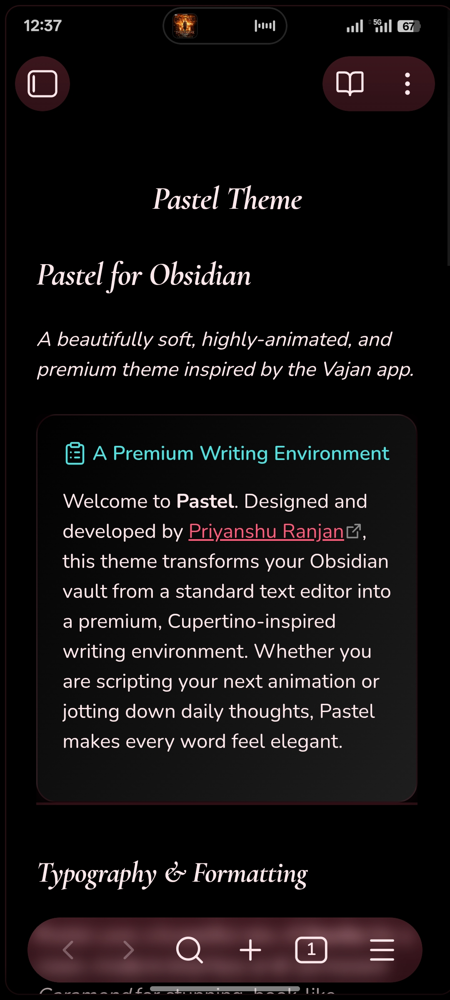

   
  <h1>🌸 Pastel Theme for Obsidian</h1>
  
<b>A beautifully soft, highly-animated, and premium theme for Obsidian.</b>

  
   
  
  

    
    
  

  

    <i>Proudly made in India 💖</i>
  

   

  
   

---

## 📖 Table of Contents
- [About](#-about)
- [Screenshots](#-screenshots)
- [Features](#-features)
- [Customization](#-customization-style-settings)
- [Installation](#-installation)
- [Inspiration](#-inspiration-the-vajan-app)

---

## ✦ About

**Pastel** transforms your Obsidian vault into a lush, native-feeling app environment. Moving away from stark and harsh contrasts, Pastel utilizes a carefully curated selection of warm colors, smooth micro-interactions, and premium Cupertino-inspired rounded UI components to create a serene and focused writing experience.

---

## 📸 Screenshots

### 💻 Desktop Experience

| ☀️ Light Mode (`assets/desktop-light.png`) | 🌙 Dark Mode (`assets/desktop-dark.png`) |
| :---: | :---: |
|  |  |

### 📱 Mobile Experience

  
  &nbsp;&nbsp;&nbsp;&nbsp;
  

---

## ✨ Features

- **📖 Premium Typography**
  - Beautifully crafted, elegant Serif headers (*Cormorant Garamond*).
  - High-readability, slightly rounded Sans-Serif body text (*Nunito*).
- **✨ Fluid Animations**
  - Experience buttery-smooth `cubic-bezier` hover transitions across workspace leaves, file explorers, tabs, buttons, and tags.
- **📱 App-Like UI Components**
  - Cupertino-inspired rounded corners on all workspace panels and modals.
  - Callouts and Blockquotes engineered as elevated, gradient-filled premium cards.
  - Active file indicators designed with an inset shadow left-border to maintain precise flexbox alignment.
- **🌗 Elegant Dark Mode**
  - Completely custom *Dark Rose* slate background designed specifically to reduce eye strain while retaining the warm pastel aesthetic. No pure harsh blacks.

---

## 🎨 Customization (Style Settings)

Pastel is fully integrated with the **[Style Settings](https://github.com/mgmeyers/obsidian-style-settings)** plugin to provide 7 distinct, professionally curated app themes out of the box.

When you switch a palette, both the accent colors and the base workspace background subtly shift to match the aesthetic.

| Palette | Description | Accent Tone |
| :--- | :--- | :--- |
| 🌹 **Rose (Default)** | Soft pinks with a vibrant red/pink accent. | `#f92f60` |
| ☕ **Bean** | Warm cream backgrounds with cocoa orange accents. | `#c8795a` |
| 🌿 **Sage** | Muted garden greens. | `#6F9275` |
| 🍯 **Honey** | Soft yellow and leaf green. | `#C79A2E` |
| 🏺 **Clay** | Earthy warm neutrals. | `#B97052` |
| 🌊 **Lagoon** | Teal, mist, and forest greens. | `#2F7D73` |
| 🍓 **Berry** | Berry accents with cream and mint. | `#9B5C75` |

**How to change palettes:**
1. Install and enable the **Style Settings** community plugin.
2. Open **Settings > Style Settings**.
3. Expand **Pastel Theme Configuration** and select your preferred *Color Palette*.

---

## 🚀 Installation

### Option 1: Community Themes (Recommended)
1. Open Obsidian **Settings** > **Appearance**.
2. Click **Manage** under the Themes section.
3. Search for **Pastel** and click **Use**.

### Option 2: Manual Installation (GitHub)
1. Download the `theme.css` and `manifest.json` from the [latest release](https://github.com/PriyanshuRnjn/Obsidian-Pastel/releases).
2. Navigate to your vault's theme folder: `.obsidian/themes/`.
3. Create a folder named `Pastel` and place the downloaded files inside.
4. Open Obsidian **Settings > Appearance** and select **Pastel** from the Themes dropdown.

---

## 💡 Inspiration: The Vajan App

The complete aesthetic, typography, and all **seven custom color palettes** were meticulously crafted and taken directly from **Vajan** — a beautiful, 100% free, no-ads weight-tracking app designed and developed by [Priyanshu Ranjan](https://github.com/PriyanshuRnjn).

If you love the look and feel of this theme, check out the app that started it all:

---

## ☕ Support the Developer

If you enjoy using the Pastel theme and it makes your daily writing more beautiful, consider supporting the development! 

**Support via UPI (India):**  
`priyanshu.ranjan@jio`

Your support is greatly appreciated and helps me keep building beautiful, free tools like Pastel and Vajan. 💖

---

  <b>Designed and Developed by <a href="https://github.com/PriyanshuRnjn">Priyanshu Ranjan</a></b>  
  <i>Proudly made in  India 🇮🇳</i>

